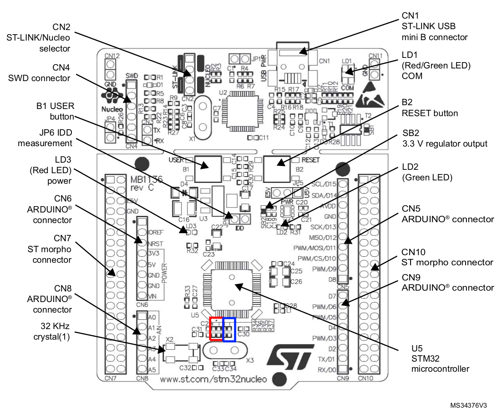

# Multi-channel temperature control

The goal of this project is to develop a temperature control system for an incubator based on an STM32F411 MCU.

This particular module is responsible for accurate temperature control in a very large container. The container houses reaction vessels as well as robotic actuators for manipulating the vessels.
To achieve this, the temperature control system will include the following features.

## Features

- Comms channels (UART and I2C) for logging data and sending commands
- 10 ADC Channels for temperature reading
- 10 Control Channels for heaters/coolers using timers
- 4 ADC Channels for internal telemetry
- PID Control loop to regulate temperature
- LEDs to monitor general application status

## Project setup

This project makes use of the CubeMX tool and its auto-generated code. To properly setup this project it is recommended to have [STM32CubeIDE](https://www.st.com/en/development-tools/stm32cubeide.html) installed.

Most of the code that is not in the Lib or Controllers folders is generated by the IDE.

### Importing and building the project 
The easiest option is to clone this repository and then go to the STM32CubeIDE and do the following: 
- Create a new workspace or select one where you want to create this project 
- Go to File -> Import 
- Select "Existing Projects into workspace" and click Next
- In Root Directory, choose the cloned repo.
- Accept the default configuration and click finish
- The project should compile without errors

If the steps above don't work, try the steps below to create a new project. 

### Creating the project with .ioc file

The .ioc file holds the device configuration and is the base of this project. In this case the MCU is a STM32F411; if using a different MCU, the configuration needs to be manually set using the CubeMX device configuration tool.

If using a Nucleo-64 board with an STM32F411, see hardware configuration [notes below](#nucleo-64-notes).

To create a new project start STM32CubeIDE and select:

- File -> New -> STM32 Project from an existing STM32CubeMX Configuration File (.ioc)
- Choose the Multichannel Temperature Control CPP.ioc file
- Targeted language is C++
- Click Finish

This will create the base for the project

### Adding Lib folder

- Copy and paste the Lib folder in your project.
- Go to the IDE, right click on the project and click Refresh
- The Lib folder should be visible, but it's not included in the project yet.

### Settings configuration

For the project to compile properly, there are a few settings that need to be adjusted.
In the Project Explorer, right click on the project and go to:

- Properties -> C/C++ Build -> Settings

First we need to add the option to print floating point numbers with printf. In settings go to:

- Tool Settings -> MCU Settings
- Tick the box that says: _Use float with printf from newlib-nano (-u_print_float)_

Next we need to add the Lib folder to the Include Path. This needs to be done for the Debug and Release build configuration. Check the top of the active window to see which configuration you are changing.

- Go to MCU G++ Compiler -> Include Paths
- Click the Add icon and choose the option to select path from Workspace
- Select the Lib/Inc folder and click OK.
- Click Apply and Close

The next step is to change the default configuration that excludes the Lib folder from build.

- In the Project Explorer, go to the Lib folder, right click and select Properties.
- In Properties, uncheck the box that says: _Exclude resource from build_
- Click Apply and Close

The last step is to make link the CPP files with main.c
STM32CubeIDE does support C++, but it creates a main.c file when regenerating the code.
To make main.c run the code found in cpp_link.cpp, we need to add a few lines of code to main.c

- Go to Core/Src/main.c
- Below the line that says /* USER CODE BEGIN PFP */ add the following:
  ```
  void cpp_main();
  ```
- In int main(), below /* USER CODE BEGIN 2 */ add: 
    ```
    cpp_main();
    ```

The project should be ready to compile without errors now. 

*IMPORTANT NOTE:* In the ```main()``` function check the MX_DMA_Init() function call is at the top of the list, otherwise the ADC+DMA will not work properly. If it's not, cut it and paste it at the top. Each time the code is regenerated do this check. 

## NUCLEO-64 Notes

Nucleo-64 boards have different models with slight differences in their hardware configuration.
The default configuration of some models can interfere with the proper functioning of the firmware. Because of this, some modifications to the configuration might be needed when running the firmware on a Nucleo-64 board instead of a custom one.

To change the configuration, some solder bridges (SB) and resistors will need to be added/removed.

The location of the SB and resistors that need to be changed for each point below will be marked in the [Hardware Layout](#hardware-layout) with the colour mentioned in brackets.

### Green LED Pin (Green)

The green user LED that comes with the board is connected to pin PA5 of the MCU.
To prevent this from interfering with the ADC signal, use the following configuration:

- SB21 OFF

### Pins PC14 and PC15 (Red)

Pins PC14 and PC15 can be used as part of the Low Speed Cock (LSE) or as GPIOs.
To set the pins as GPIO, the following configuration is needed:

- SB48 and SB49 ON
- R34 and R36 removed

### HSE Clock Source (Blue)

Depending on the board model, the HSE might be off or set to use the MCO from the ST-LINK MCU.
To use the MCO from the ST-LINK, the following configuration is needed:

- SB55 OFF and SB54 ON
- SB16 and SB50 ON
- R35 and R37 removed

\*_Note:_ If HSE is set to use X3 (Not included), change the RCC in the Device Configuration Tool from HSE: BYPASS Clock Source to HSE: Crystal/Ceramic Resonator.

### Hardware Layout

<p align="center">
<p align="center"><b>Fig. 1 </b>  Hardware Layout Top View. ( Source: 
<a href="https://www.st.com/resource/en/user_manual/um1724-stm32-nucleo64-boards-mb1136-stmicroelectronics.pdf">Nucleo-64 User Manual</a> )</p>

<p align="center">
<p align="center"><b>Fig. 2 </b> Hardware Layout Bottom View. ( Source: 
<a href="https://www.st.com/resource/en/user_manual/um1724-stm32-nucleo64-boards-mb1136-stmicroelectronics.pdf">Nucleo-64 User Manual</a> )</p>

## Credits

- [Salavat Magazov](https://github.com/Vavat)
